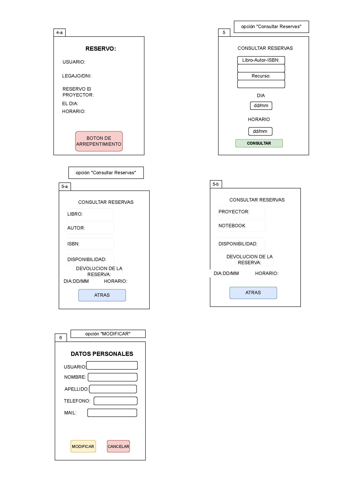

# 

# 

Integrantes:

* Klimavicius, Lourdes  
* Molina, Emmanuel  
* Sánchez, Lucas  
* Toledo, Cristian

  # 

  # 

  # 

  # 

  # 

  # ÍNDICE:

[**INTRODUCCIÓN	2**](#introducción)

[a. Propósito	2](#propósito)

[b. Contexto	2](#contexto)

[c. Alcance	2](#alcance)

[d. Referencias	2](#referencias)

[**DESCRIPCIÓN GENERAL DEL PROYECTO	3**](#descripción-general-del-proyecto)

[**REQUERIMIENTOS Y RESTRICCIONES	3**](#requerimientos-y-restricciones)

[a.    Requerimientos Funcionales	3](#a.-requerimientos-funcionales)

[1\. Registro de Usuarios:	3](#registro-de-usuarios:)

[2\. Gestión de Recursos:	3](#gestión-de-recursos:)

[3\. Préstamo de Recursos:	3](#préstamo-de-recursos:)

[4\. Reserva de Recursos:	3](#reserva-de-recursos:)

[5\. Notificaciones:	4](#notificaciones:)

[b.   Requerimientos no Funcionales	4](#b.-requerimientos-no-funcionales)

[**CONCLUSIÓN	4**](#conclusión)

[**GLOSARIO	5**](#glosario)

[DEFINICIONES, ACRÓNIMOS Y ABREVIATURAS	7](#definiciones,-acrónimos-y-abreviaturas)

[**DIAGRAMA DE CONTEXTO	8**](#diagrama-de-contexto)

[Aclaraciones del Diagrama de Contexto	8](#aclaraciones-del-diagrama-de-contexto)

[**DIAGRAMA DE CASO DE USO	10**](#diagrama-de-caso-de-uso)

[**PROTOTIPO	11**](#prototipo)

[**ENTREVISTAS	14**](#entrevistas)

# 

# PROYECTO \- BIBLIOTECA

# INTRODUCCIÓN {#introducción}

1. ## **Propósito** {#propósito}

     
   El objetivo de este proyecto es desarrollar un sistema automatizado que gestione y organice el registro de préstamos y reservaciones de libros, así como de otros recursos disponibles en la institución. Este sistema tiene como finalidad facilitar el acceso a estos recursos para los usuarios y mantener un seguimiento ordenado y eficiente del contenido del establecimiento, contribuyendo a ampliar la variedad de libros y recursos digitales disponibles.

2. ## **Contexto** {#contexto}

     
   Actualmente, la biblioteca enfrenta dificultades en el seguimiento de los préstamos de libros y otros recursos debido a la gestión manual que se realiza. Esta metodología no solo requiere de la presencia del personal encargado, sino que también genera pérdida de registros, lo que repercute negativamente en la funcionalidad y eficiencia del servicio. Estas limitaciones impactan tanto a los usuarios como al personal, reduciendo la calidad del servicio ofrecido.

3. ## **Alcance** {#alcance}

* Registro de préstamo, reserva y devolución de libros y otros recursos.  
* Mantenimiento de una base de datos con los registros de usuarios y un listado actualizado de recursos prestados.  
* Implementación de un sistema de reservas y renovaciones de libros vía web.  
* Acceso al inventario de libros en línea, disponible para usuarios registrados.  
* Acceso al sistema para alumnos, profesores y directivos registrados en la institución.  
* Integración del sistema con el campus de la institución.  
* Compatibilidad del sistema con tecnología de códigos de barras y QR.

4. ## **Referencias** {#referencias}

* Documentación creada para el uso del nuevo sistema.  
* Realización de encuestas a alumnos y profesores sobre la facilidad de uso del registro actual y cómo mejoraría con el nuevo sistema.  
* Entrevistas con el personal encargado de la biblioteca.  
* Observación del entorno de trabajo para evaluar cómo podría el sistema mejorar la gestión actual.

  # DESCRIPCIÓN GENERAL DEL PROYECTO {#descripción-general-del-proyecto}

Este proyecto busca desarrollar un sistema integral de gestión para la biblioteca de la institución, enfocado en mejorar la eficiencia y la accesibilidad de los servicios ofrecidos. El sistema permitirá la automatización del registro de préstamos y reservas de libros y otros recursos, facilitando tanto la labor del personal bibliotecario como el acceso de los usuarios a estos recursos. Además, se integrará con el entorno digital del campus, permitiendo a alumnos, profesores y directivos realizar consultas y reservas en línea. La plataforma incluirá fuertes características de seguridad  y será compatible con diversas tecnologías, como códigos de barras y QR, para optimizar la gestión y seguimiento de los recursos.

# REQUERIMIENTOS Y RESTRICCIONES {#requerimientos-y-restricciones}

## **a.   	Requerimientos Funcionales** {#a.-requerimientos-funcionales}

1. ### **Registro de Usuarios:** {#registro-de-usuarios:}

   * El sistema debe permitir registrar a los usuarios, habilitando la confirmación y cancelación de reservaciones y préstamos en tiempo real.  
   * Registro de un historial de préstamos y reservas para cada usuario.

2. ### **Gestión de Recursos:** {#gestión-de-recursos:}

   * El sistema debe mantener un inventario actualizado de todos los recursos disponibles en la biblioteca.  
   * Registro de nuevos libros en la base de datos (título, autor, género, ISBN, etc.).  
   * Funcionalidad de búsqueda y consulta de libros disponibles por título, autor o categoría.

3. ### **Préstamo de Recursos:** {#préstamo-de-recursos:}

   * El sistema debe permitir registrar los préstamos, indicando el usuario, la fecha de préstamo y la fecha estimada de devolución.  
   * Implementación de un sistema de penalización por devoluciones tardías.  
   * Limitación en la cantidad de libros que una persona puede tomar prestados y en las renovaciones.

4. ### **Reserva de Recursos:** {#reserva-de-recursos:}

   * Los usuarios deben poder reservar recursos a través del sistema, con confirmación automática de disponibilidad.  
   * Envío de notificaciones por correo electrónico para mantener informados a los usuarios sobre el estado de sus préstamos y reservas.

5. ### **Notificaciones:** {#notificaciones:}

   * El sistema debe enviar notificaciones a los usuarios sobre la disponibilidad de los recursos reservados y recordatorios para la devolución de los recursos prestados.

   ## **b.  	Requerimientos no Funcionales** {#b.-requerimientos-no-funcionales}

* El sistema debe garantizar la protección de los datos personales mediante medidas de seguridad como encriptación y control de acceso.  
* Debe ser capaz de gestionar un alto volumen de usuarios y recursos sin colapsar.  
* Garantizar tiempos de respuesta rápidos para búsquedas y registros.  
* La interfaz debe ser intuitiva y fácil de usar.  
* El sistema debe estar disponible en todo momento y contar con un sistema de respaldo en caso de fallas en la energía o internet.  
* Debe incluir guías y tutoriales para facilitar el uso de la plataforma.  
* El sistema debe ser capaz de manejar un alto volumen de solicitudes de acceso y descarga de recursos digitales.  
* Debe ser adaptable a diferentes dispositivos, como navegadores, teléfonos móviles y tabletas.  
* Las actualizaciones del sistema deben poder instalarse sin interrumpir su funcionamiento por más de 10 minutos.  
* El sistema debe gestionar los permisos de acceso según la jerarquía de los usuarios que interactúan con la aplicación.

  # CONCLUSIÓN {#conclusión}

La implementación de un sistema automatizado para la gestión de préstamos y reservas en la biblioteca es esencial para superar las limitaciones del sistema manual actual. La digitalización de este proceso permitirá un registro y seguimiento en tiempo real de los préstamos, mejorando la precisión del inventario y proporcionando una interfaz accesible para los usuarios. Además, este sistema optimizará los procesos internos, modernizando la gestión de recursos y mejorando la calidad del servicio. Se aplicarán altas medidas de seguridad para proteger los datos personales de los usuarios, creando un entorno de confianza. Al cumplir con los requerimientos funcionales y no funcionales, este proyecto garantizará una operación eficiente y un servicio de alta calidad.

# GLOSARIO {#glosario}

| Términos | Sinónimos | Descripción |
| :---- | :---- | :---- |
| Usuario Estudiante | Alumno, Estudiante | Persona que forma parte del cuerpo estudiantil de la institución y utiliza los servicios de la biblioteca. Solicita el préstamo o la reserva de libros y otros recursos como notebooks y proyectores. |
| Usuario Profesor | Docente | Persona del cuerpo docente que utiliza la biblioteca tanto para uso personal como para obtener recursos educativos para sus clases. |
| Administrativo Bibliotecario  | Personal administrativo | Persona que trabaja en la gestión administrativa de la institución y que puede acceder a los recursos de la biblioteca para tareas relacionadas con su trabajo. |
| Bibliotecario | Encargado de la biblioteca | Persona responsable de la gestión diaria de la biblioteca. Supervisa préstamos, reservas y el inventario de libros y recursos tecnológicos (notebooks, proyectores). |
| Administrador del Sistema | Técnico de sistemas | Persona encargada de mantener el sistema informático que gestiona los préstamos, reservas e inventario de la biblioteca. Asegura el funcionamiento del software y la infraestructura técnica. |
| Proveedor Externo | Distribuidor, Suministrador | Empresa o persona externa que proporciona recursos a la biblioteca, tales como libros, notebooks, proyectores y otros equipos tecnológicos. |
| Usuario Invitado | Usuario externo, Visitante | Persona no afiliada a la institución que tiene acceso limitado a los recursos de la biblioteca según las políticas internas. |
| Autoridades Institucionales | Directivos, Jefatura | Personal directivo de la institución que toma decisiones sobre el presupuesto, políticas y estrategias relacionadas con la biblioteca. |

# DEFINICIONES, ACRÓNIMOS Y ABREVIATURAS {#definiciones,-acrónimos-y-abreviaturas}

* Encriptación: Proceso de conversión de datos legibles en un formato codificado, accesible solo para quienes tienen la clave adecuada, protegiendo la información durante el almacenamiento y la transmisión.  
* Sistema: Software encargado de gestionar de manera segura y eficiente grandes cantidades de información, permitiendo el almacenamiento y recuperación de datos en tiempo real.  
* Usuarios: Personas que interactúan diariamente con el sistema.  
* ISBN: Número único que identifica de manera específica a cada libro publicado, facilitando su catalogación en el ámbito editorial y bibliotecario.

  # DIAGRAMA DE CONTEXTO {#diagrama-de-contexto}

  # 

## **Aclaraciones del Diagrama de Contexto** {#aclaraciones-del-diagrama-de-contexto}

Usuarios (engloban a los Alumnos y Profesores del establecimiento).

* Novedad\_Reserva: reserva de libro o recurso, según disponibilidad. El sistema provee los días y horas disponibles del inventario.  
* Novedad\_Préstamo: renovación de préstamo de libro. Los recursos como Notebook y proyectores no se renuevan.  
* Novedad\_Historial: consulta de historial de préstamos que posee el usuario.  
* Novedad\_Inicio\_Sesion: El usuario, luego de obtener la autorización del bibliotecario, ingresa al sistema mediante su correo/DNI y contraseña.   
* Novedad\_Busqueda: Apartado que permite al usuario realizar una búsqueda en el sistema de libro o recurso mediante filtros preestablecidos y verificar su disponibilidad.   
* Informe\_Historial: devuelve fechas y nombres de libros o recursos prestados históricamente.  
* Informe\_Préstamo: libros, recursos, fecha de devolución, retraso.  
* Informe\_Reserva: libro reservado, fecha vto. retiro. Recurso reservado, fecha de retiro.  
* Informe\_Busqueda: datos libro o recurso, estado (disponible, prestado, reservado), ubicación dentro de biblioteca.  
* Informe\_Notificación: vto. préstamo, vto. de reservas, confirmación de reserva (libro o recurso), retraso e informe de multas.  
* Informe\_ID\_Usuario: datos para el ingreso al Sistema Biblioteca.  
  Bibliotecario (Administrativo de Biblioteca, Directivos y Administrativos)  
  El Bibliotecario y Administrativo de Biblioteca poseen permisos especiales de acceso al sistema.  
* Novedad\_Inventario: Ingreso y actualización de estado de recurso (reservado, prestado, devolución, baja, no disponible por reparación).  
* Novedad\_Usuario: alta, baja, modificación, levantar suspensión (con recibo de Cooperadora), dar acceso al sistema a nuevos usuarios.  
* Información\_Usuarios: estado (suspendido, normal o habilitado), datos de usuario, recursos y libros prestados.  
* Información\_Inventario: datos de libros y recursos, cantidad, estado (prestado, devuelto, reservado), fecha de ingreso, baja, reparación, observaciones.

  # DIAGRAMA DE CASO DE USO {#diagrama-de-caso-de-uso}

  # 

  # 

  

  # PROTOTIPO {#prototipo}

  

  

  

  

# ENTREVISTAS {#entrevistas}

De la entrevista realizada al personal de Biblioteca y Dirección, surgieron los siguientes datos que se utilizaron para definir los requerimientos y restricciones:

* Los libros que son escasos y de alta demanda se prestan por un máximo de 3 días sin posibilidad de renovación.  
* La devolución tardía de libros o materiales de la biblioteca se sanciona con una colaboración a la cooperadora, sin un valor fijo establecido.  
* Cada alumno puede tomar prestados hasta un máximo de 3 libros.  
* Los libros se prestan por un periodo de hasta 15 días con opción de renovación.  
* El número máximo de renovaciones permitido es de 2\.  
* Los recursos, como notebooks, pueden prestarse para uso fuera del instituto si hay una justificación válida.  
* Los recursos como notebooks y proyectores se prestan generalmente durante el día y para uso dentro del instituto.  
* El registro de préstamos se realiza en planillas de papel, tanto para libros como para los recursos.  
* Los registros de inventario están en libros físicos escritos a mano; no existe un inventario digital.  
* El presupuesto destinado a mejoras de la biblioteca es limitado.  
* La partida presupuestaria para la biblioteca puede incrementarse si se justifica adecuadamente.  